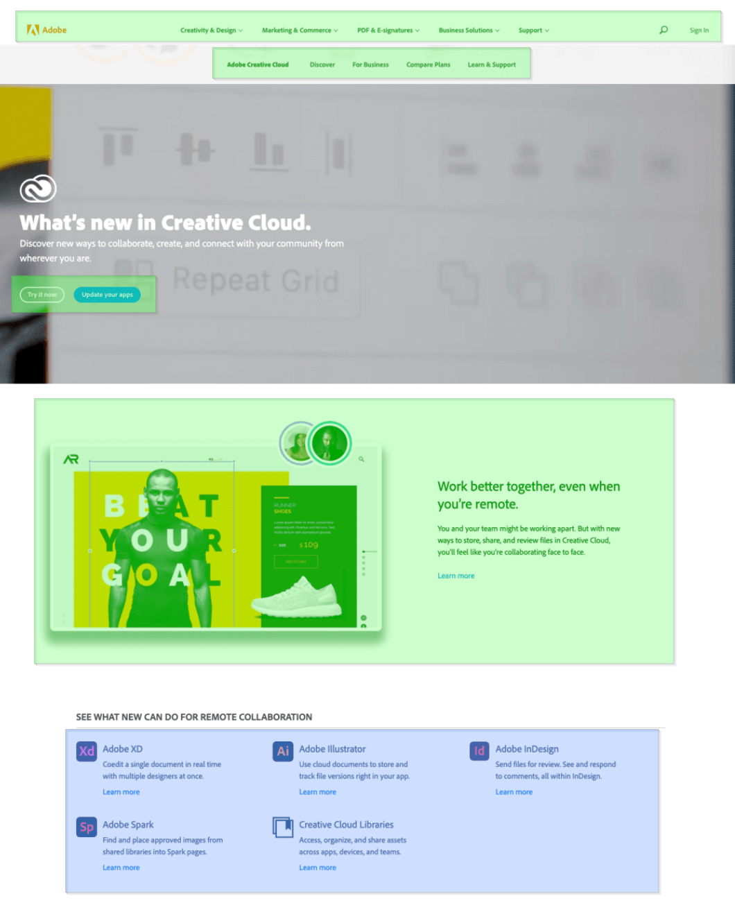

Suche dir 1 - 3 Designs von https://lookup.design aus und analysiere sie.
Zeichne grüne Boxen über Flex-Container und blaue Boxen über Grid-Container.
Zeige deine Analysen anschliessend der Klasse.

